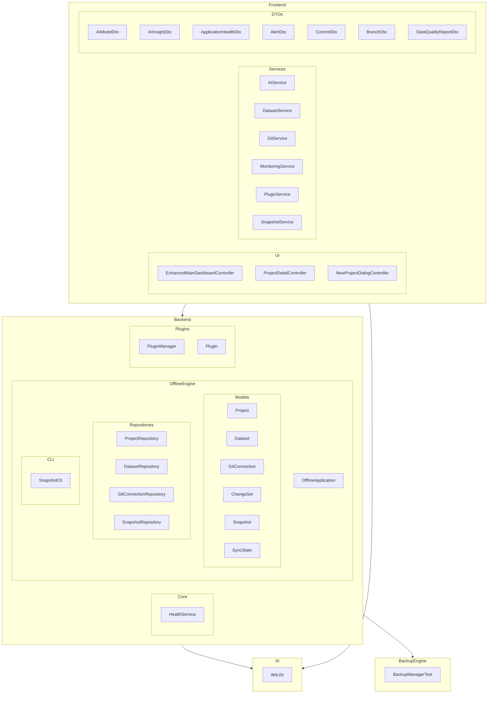

    

    <b>Automatic Architecture Diagrams from Code</b> 
    <a href="https://github.com/swark-io/swark">GitHub</a> • <a href="https://swark.io">Website</a> • <a href="mailto:contact@swark.io">Contact Us</a>

## Usage Instructions

1. **Render the Diagram**: Use the links below to open it in Mermaid Live Editor, or install the [Mermaid Support](https://marketplace.visualstudio.com/items?itemName=bierner.markdown-mermaid) extension.
2. **Recommended Model**: If available for you, use `claude-3.5-sonnet` [language model](vscode://settings/swark.languageModel). It can process more files and generates better diagrams.
3. **Iterate for Best Results**: Language models are non-deterministic. Generate the diagram multiple times and choose the best result.

## Generated Content
**Model**: GPT-4o - [Change Model](vscode://settings/swark.languageModel)  
**Mermaid Live Editor**: [View](https://mermaid.live/view#pako:eNqNVctu2zAQ_BWD56Qf4EOBREpbA3XzsHvTZSOtJbbUkuCjhRHk30u9XFGkjOhkzeyOdpa79BsrZYVsywqqNahmc8wL2vjHuNcB-KIlWaRqgAPq5-4_2D0P1ACVWO2BUw6meZWgq8ynaykE6jD4SctfWNocLXCxFvQD_05xHISsU3Hp2g6o__ASTah3txvxEM7BgkGb5L7yNL6XxK3UnOok_SRczSmi0sXmx8eo0L0_F5FbucR3ZHjd2JhRSvASLJf0DUHYJo7wbYvzMtm2PIbvtT_KWKPr1LMDwe35BZVc6F3c9T8Wg3QP5e-0_UzqRfcGBx_s3uPpJDjhA_mGL3RGatabkL9o9N1enMFsSmNiHJmY8PPip5R8UvS1vt1-RWo8pDIPBMo0MsWcqTxYsAt3QTsCO93ZmH48cd3UJei8au9aSGD0WuDkay1m3UZ6ieeayd1bF8y-79a1MsGv6KRnb1hzk9r9PRDU0a3XUx_cmLtZsaDUJ3W-vl1OLXdgQMdKjmhsJDBd75vb28_hio4vPTFVMsfiLwZaXQq7YS3qFnjl_2HeCmYbbLFg203BKjyBE7Zg7z7IqcoPt7_ivZeWba12eMPAWdkN_vSupasbtj2BMPj-D_gt5w8) | [Edit](https://mermaid.live/edit#pako:eNqNVctu2zAQ_BWD56Qf4EOBREpbA3XzsHvTZSOtJbbUkuCjhRHk30u9XFGkjOhkzeyOdpa79BsrZYVsywqqNahmc8wL2vjHuNcB-KIlWaRqgAPq5-4_2D0P1ACVWO2BUw6meZWgq8ynaykE6jD4SctfWNocLXCxFvQD_05xHISsU3Hp2g6o__ASTah3txvxEM7BgkGb5L7yNL6XxK3UnOok_SRczSmi0sXmx8eo0L0_F5FbucR3ZHjd2JhRSvASLJf0DUHYJo7wbYvzMtm2PIbvtT_KWKPr1LMDwe35BZVc6F3c9T8Wg3QP5e-0_UzqRfcGBx_s3uPpJDjhA_mGL3RGatabkL9o9N1enMFsSmNiHJmY8PPip5R8UvS1vt1-RWo8pDIPBMo0MsWcqTxYsAt3QTsCO93ZmH48cd3UJei8au9aSGD0WuDkay1m3UZ6ieeayd1bF8y-79a1MsGv6KRnb1hzk9r9PRDU0a3XUx_cmLtZsaDUJ3W-vl1OLXdgQMdKjmhsJDBd75vb28_hio4vPTFVMsfiLwZaXQq7YS3qFnjl_2HeCmYbbLFg203BKjyBE7Zg7z7IqcoPt7_ivZeWba12eMPAWdkN_vSupasbtj2BMPj-D_gt5w8)

