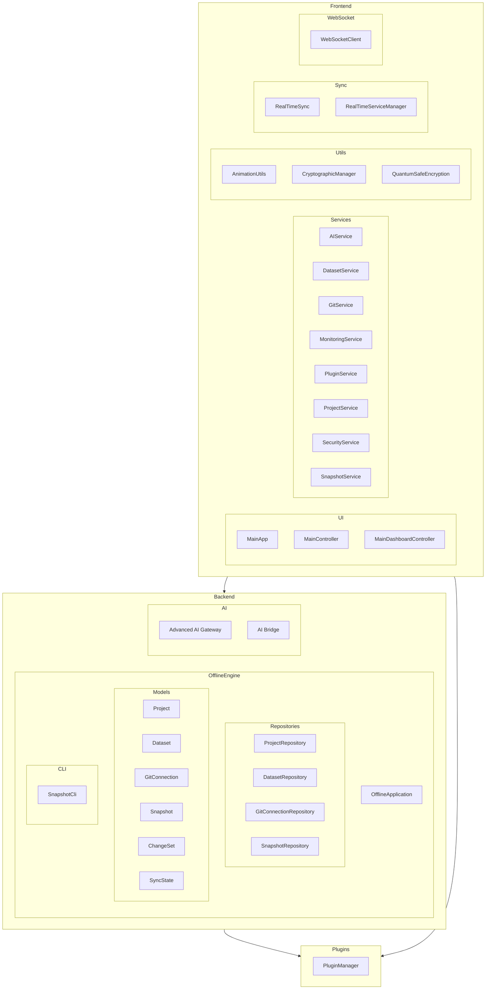

    

    <b>Automatic Architecture Diagrams from Code</b> 
    <a href="https://github.com/swark-io/swark">GitHub</a> • <a href="https://swark.io">Website</a> • <a href="mailto:contact@swark.io">Contact Us</a>

## Usage Instructions

1. **Render the Diagram**: Use the links below to open it in Mermaid Live Editor, or install the [Mermaid Support](https://marketplace.visualstudio.com/items?itemName=bierner.markdown-mermaid) extension.
2. **Recommended Model**: If available for you, use `claude-3.5-sonnet` [language model](vscode://settings/swark.languageModel). It can process more files and generates better diagrams.
3. **Iterate for Best Results**: Language models are non-deterministic. Generate the diagram multiple times and choose the best result.

## Generated Content
**Model**: GPT-4o - [Change Model](vscode://settings/swark.languageModel)  
**Mermaid Live Editor**: [View](https://mermaid.live/view#pako:eNqNVl9vmzAQ_yrIz-0XyMOkNNmqSIu2lVZ7MHm4wAHewEbGdIqqfvddAFNsnCa8xPe73_3Fd-SNpSpDtmKJLDQ0ZfS8TWRET9sdB-CbVtKgzAbYUb3sPsDzswch103Dx9_DUrshX1pVFWruigHuFtryqEBnnlEAn1mHM41Rv4oUWzfKejfifDp5eWzBQIvG0lzR4z6Kifdx9OtSUhilhSwsdYF4Fj-rrhDSsh3JZ2r1B9MpB1f0uDGmnRbmZMmefLWfL0ZUfjOlqMEIJXsdd0Uv_EafGqN6VyLdg4SC3m0I9Ox-dSBNV8eQ41eZnvkUgAfR61fiJFPX-xNC9SxqPGv4XDhc4A3NsvmH4at5_MZjrNK_aNwgE7ypBErDPTnktj940_sAZBOM-yPPKyGpY3Sh0I09qmiEK5H2L5EvIa8pk98nbFTbX2l_3GaXdCKd-AI5LK3GuZtZLZCAFU0hrQhJzindme0FPOAhltC0pZoHXkKendNtpzN72rTV5Z7YTlyu31Z9rVa3wk_qmqoJcDYlyIIus-HTKeSJxiM2YGiF2NPN_Qgv5Xl-03py5ZsjbL7vLjunQeKz82dOwxO03vmfk0cq_x-c-Dp7BZliRlA0Ygef-6BFVpy_PNFwunWih0_ArGkDYLeQIx0WbuzXPLq__-Iuh1HoFU4Mx2TSsDtWo65BZPTn4S1hpsQaE7aKEpZhDl1lEvZOpK7JqAFbAZR9zVZGd3jHoDPqfF-srFVXlGyVQ9Xi-3_H-aZ_) | [Edit](https://mermaid.live/edit#pako:eNqNVl9vmzAQ_yrIz-0XyMOkNNmqSIu2lVZ7MHm4wAHewEbGdIqqfvddAFNsnCa8xPe73_3Fd-SNpSpDtmKJLDQ0ZfS8TWRET9sdB-CbVtKgzAbYUb3sPsDzswch103Dx9_DUrshX1pVFWruigHuFtryqEBnnlEAn1mHM41Rv4oUWzfKejfifDp5eWzBQIvG0lzR4z6Kifdx9OtSUhilhSwsdYF4Fj-rrhDSsh3JZ2r1B9MpB1f0uDGmnRbmZMmefLWfL0ZUfjOlqMEIJXsdd0Uv_EafGqN6VyLdg4SC3m0I9Ox-dSBNV8eQ41eZnvkUgAfR61fiJFPX-xNC9SxqPGv4XDhc4A3NsvmH4at5_MZjrNK_aNwgE7ypBErDPTnktj940_sAZBOM-yPPKyGpY3Sh0I09qmiEK5H2L5EvIa8pk98nbFTbX2l_3GaXdCKd-AI5LK3GuZtZLZCAFU0hrQhJzindme0FPOAhltC0pZoHXkKendNtpzN72rTV5Z7YTlyu31Z9rVa3wk_qmqoJcDYlyIIus-HTKeSJxiM2YGiF2NPN_Qgv5Xl-03py5ZsjbL7vLjunQeKz82dOwxO03vmfk0cq_x-c-Dp7BZliRlA0Ygef-6BFVpy_PNFwunWih0_ArGkDYLeQIx0WbuzXPLq__-Iuh1HoFU4Mx2TSsDtWo65BZPTn4S1hpsQaE7aKEpZhDl1lEvZOpK7JqAFbAZR9zVZGd3jHoDPqfF-srFVXlGyVQ9Xi-3_H-aZ_)

