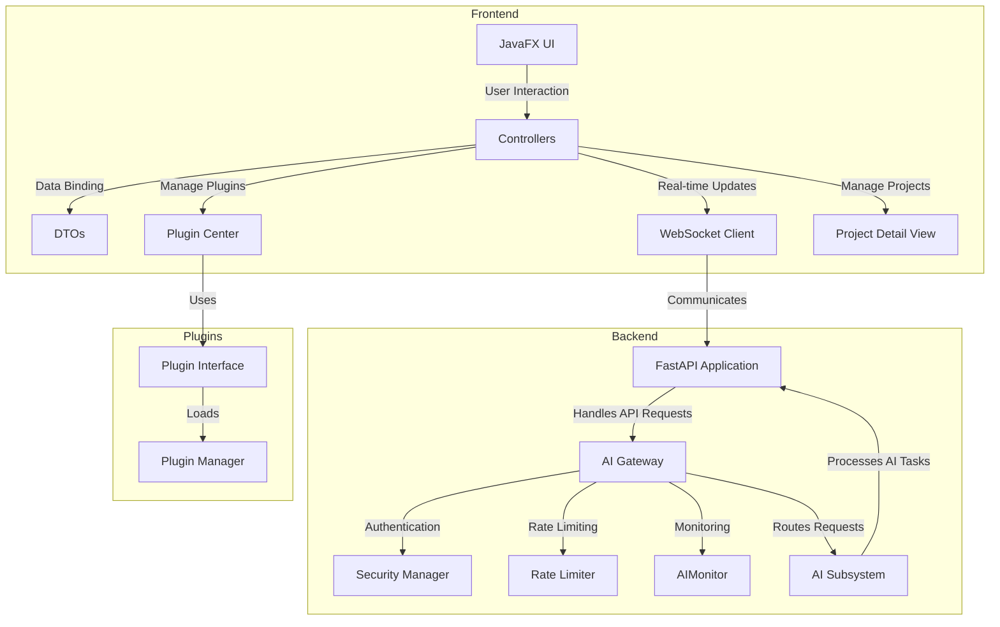

    

    <b>Automatic Architecture Diagrams from Code</b> 
    <a href="https://github.com/swark-io/swark">GitHub</a> • <a href="https://swark.io">Website</a> • <a href="mailto:contact@swark.io">Contact Us</a>

## Usage Instructions

1. **Render the Diagram**: Use the links below to open it in Mermaid Live Editor, or install the [Mermaid Support](https://marketplace.visualstudio.com/items?itemName=bierner.markdown-mermaid) extension.
2. **Recommended Model**: If available for you, use `claude-3.5-sonnet` [language model](vscode://settings/swark.languageModel). It can process more files and generates better diagrams.
3. **Iterate for Best Results**: Language models are non-deterministic. Generate the diagram multiple times and choose the best result.

## Generated Content
**Model**: GPT-4o - [Change Model](vscode://settings/swark.languageModel)  
**Mermaid Live Editor**: [View](https://mermaid.live/view#pako:eNp9k92O2jAQhV9l5OvlBbioFJINBMgW8dNWSvZiSAZwN7Gpf7pCy757nZgIU1XNXc43PnM8k3ywStbExqwUR4XnE2yTUoB7tN17YYLVG4naq90TFSlqE60yiM7nhldouBSvdz4pogymaOgdL4EcFxuqrOLmAjkKPJIKYFKs3QFY8pabB_DszHIpuJGhmnYtNnavL9pQewN9yL_Cp0oK85B-WszxN6Y_YJcFhrMidoVKNg0pHehZkWy_hsK8-E77jXQjMRA3nIQJ4KJYNfbIBcROf7jGslgp-ZMqAwkZ5A184_T-n9zeR98N8sE665wPWFHg_jLAx8EGxhGMRl-uMxR1Qxq63a3plyVt9BUmvmTSl0TWnFz421avEIfwviMujldIQnZbUg-eHw5Ja1zPe790CDXt-U6T8rfCyveceTzrcYIGYcJF3TtnIVoTNiPDW4LduXbRnPc85H4awyyvsPgX9GtxdDnEWgyxnJh7Ke-lpcTaaS9D4bxXY9m2VnQD6w5EHqU9cuYVad1NPIMt6jdfwJ5YS6pFXrv_7qNkbuItlWwMJavpgLYxJft0Rba_VcLRfRMtGxtl6YmhNXJzEdXwrqQ9ntj4gI2mzz-tRS3N) | [Edit](https://mermaid.live/edit#pako:eNp9k92O2jAQhV9l5OvlBbioFJINBMgW8dNWSvZiSAZwN7Gpf7pCy757nZgIU1XNXc43PnM8k3ywStbExqwUR4XnE2yTUoB7tN17YYLVG4naq90TFSlqE60yiM7nhldouBSvdz4pogymaOgdL4EcFxuqrOLmAjkKPJIKYFKs3QFY8pabB_DszHIpuJGhmnYtNnavL9pQewN9yL_Cp0oK85B-WszxN6Y_YJcFhrMidoVKNg0pHehZkWy_hsK8-E77jXQjMRA3nIQJ4KJYNfbIBcROf7jGslgp-ZMqAwkZ5A184_T-n9zeR98N8sE665wPWFHg_jLAx8EGxhGMRl-uMxR1Qxq63a3plyVt9BUmvmTSl0TWnFz421avEIfwviMujldIQnZbUg-eHw5Ja1zPe790CDXt-U6T8rfCyveceTzrcYIGYcJF3TtnIVoTNiPDW4LduXbRnPc85H4awyyvsPgX9GtxdDnEWgyxnJh7Ke-lpcTaaS9D4bxXY9m2VnQD6w5EHqU9cuYVad1NPIMt6jdfwJ5YS6pFXrv_7qNkbuItlWwMJavpgLYxJft0Rba_VcLRfRMtGxtl6YmhNXJzEdXwrqQ9ntj4gI2mzz-tRS3N)

