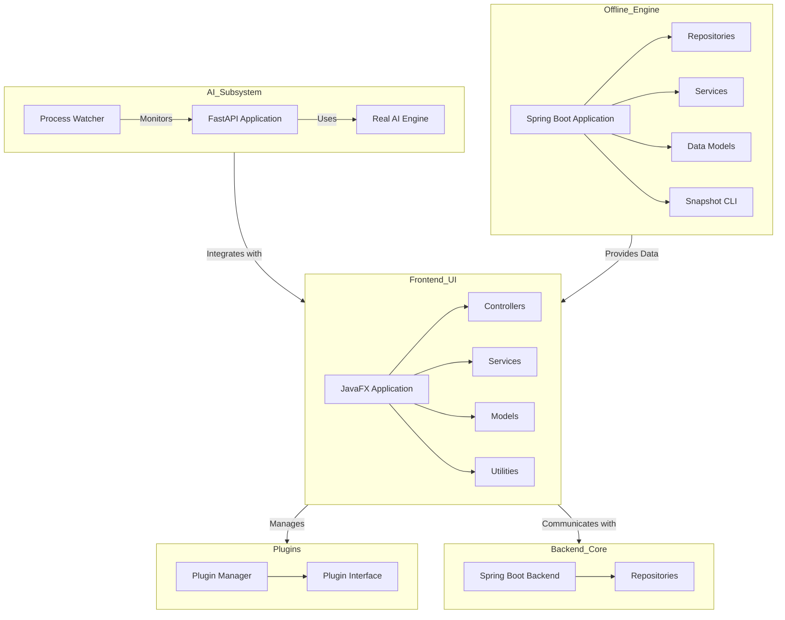

    

    <b>Automatic Architecture Diagrams from Code</b> 
    <a href="https://github.com/swark-io/swark">GitHub</a> • <a href="https://swark.io">Website</a> • <a href="mailto:contact@swark.io">Contact Us</a>

## Usage Instructions

1. **Render the Diagram**: Use the links below to open it in Mermaid Live Editor, or install the [Mermaid Support](https://marketplace.visualstudio.com/items?itemName=bierner.markdown-mermaid) extension.
2. **Recommended Model**: If available for you, use `claude-3.5-sonnet` [language model](vscode://settings/swark.languageModel). It can process more files and generates better diagrams.
3. **Iterate for Best Results**: Language models are non-deterministic. Generate the diagram multiple times and choose the best result.

## Generated Content
**Model**: GPT-4o - [Change Model](vscode://settings/swark.languageModel)  
**Mermaid Live Editor**: [View](https://mermaid.live/view#pako:eNqNVdtuozAQ_RXLz-0P5GGlNGkkVhs1Klt1JYMiFwawFmxkm6yqpv--Aw4J1wgewDM-Mz6ek5l80UjFQFc0kKnmZUZ-bwNJ8DHVh3OsvaNffZhPY6FwW_WD3nVZsh03dn3wCK5zEXErlAx7oINWERjzzm2UgWYXk1zsPvYVeL72nmUqJLDaQCdxZjg8mTw-_ji_GTDnYeSd45ugvZLCKu0CMZPDg4wDObj5S5LkmPA4zNv691xI5pdayJQ8KWVnqtDCX6FUpj5agGFdYwLrgz4JZM7axQRmj8Llhm255cStJ0CbXx7zJS9NhvzQCKevUVdmkugCeEtxAdTRXABEpvO67LSSFjeOb94t1dXZqPKTn_juz4wgV-gGv1rlOWjDOusp6D1Bbkc7RUZi3Ahbgfv1W1gxk6MtxRTLRfixHnfAQ0XuQBvy86oc8grbpJPKOTCR5Gnd-o1JLmY4wnl4ik54BC3y6gjncjb8huHzDJ949NcVVHe6ufWOuvmyEY6hSzq5m7bhORU84todts20qq-F7C0Y8k_Y7Dz-8fenVBOEU-8kYgypZ8NESMfhRmJTTpyIPQ2HqI0qikrW7XQl068ofaAF6IKLGP9PvgJqMyggoCsS0BgSXuU2oN8IqsoYc2wFx4sVdGV1BQ-UV1b5nzJqba2qNKOrhOcGvv8DqQE1Lw) | [Edit](https://mermaid.live/edit#pako:eNqNVdtuozAQ_RXLz-0P5GGlNGkkVhs1Klt1JYMiFwawFmxkm6yqpv--Aw4J1wgewDM-Mz6ek5l80UjFQFc0kKnmZUZ-bwNJ8DHVh3OsvaNffZhPY6FwW_WD3nVZsh03dn3wCK5zEXErlAx7oINWERjzzm2UgWYXk1zsPvYVeL72nmUqJLDaQCdxZjg8mTw-_ji_GTDnYeSd45ugvZLCKu0CMZPDg4wDObj5S5LkmPA4zNv691xI5pdayJQ8KWVnqtDCX6FUpj5agGFdYwLrgz4JZM7axQRmj8Llhm255cStJ0CbXx7zJS9NhvzQCKevUVdmkugCeEtxAdTRXABEpvO67LSSFjeOb94t1dXZqPKTn_juz4wgV-gGv1rlOWjDOusp6D1Bbkc7RUZi3Ahbgfv1W1gxk6MtxRTLRfixHnfAQ0XuQBvy86oc8grbpJPKOTCR5Gnd-o1JLmY4wnl4ik54BC3y6gjncjb8huHzDJ949NcVVHe6ufWOuvmyEY6hSzq5m7bhORU84todts20qq-F7C0Y8k_Y7Dz-8fenVBOEU-8kYgypZ8NESMfhRmJTTpyIPQ2HqI0qikrW7XQl068ofaAF6IKLGP9PvgJqMyggoCsS0BgSXuU2oN8IqsoYc2wFx4sVdGV1BQ-UV1b5nzJqba2qNKOrhOcGvv8DqQE1Lw)

